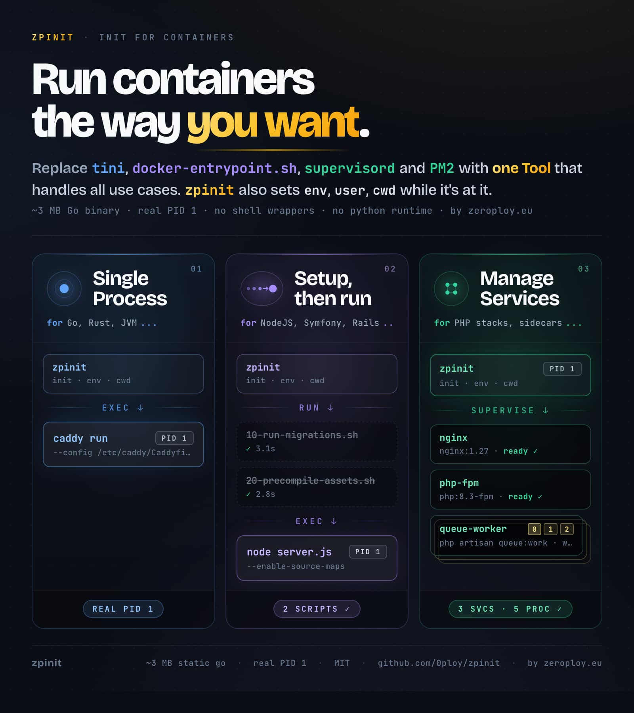

# zpinit

> One static Go binary that runs as PID 1 in your Docker container.
> Replaces:
> 
> - **tini**
> - **`docker-entrypoint.sh`**
> - **supervisord**
> - **PM2**
> 
> ~3 MB, no Python, no runtime dependencies.



## What zpinit solves

Every container image needs the same three pieces of plumbing:

- **A zombie reaper** so orphans don't pile up under PID 1. Today
  that's tini, dumb-init, or hope.
- **A `docker-entrypoint.sh`** that runs migrations, fixes permissions,
  renders config from env, then `exec`s the real CMD.
- **A process supervisor** for images that run more than one thing
  (php-fpm + nginx, redis + worker). Today that's supervisord (~30-50 MB 
  of Python), or PM2 in front of Node.

Three tools, three config formats, three mental models. zpinit folds all three jobs into one static binary with one TOML schema.

## Try it in 30 seconds

```sh
docker run -tid --name zpinit ghcr.io/0ploy/zpinit

docker exec -it zpinit bash

apk add --no-cache nginx

cat > /etc/zpinit/services/10_nginx.toml <<'EOF'
command = ["/usr/sbin/nginx", "-g", "daemon off;"]
restart = "always"
EOF

zpctl reread       # diff preview
zpctl update       # apply
zpctl status       # nginx -- RUNNING

curl -I http://localhost
```

The published image runs zpinit as PID 1 with no services configured:
the control socket is up, `zpctl` works, and the container stays alive.
Once your service set is right, bake the TOML into your own image.

## The three modes

zpinit detects the mode from your CMD at startup. Same binary, three
behaviors, no flags.

| Mode                                            | When zpinit picks it          | Replaces                |
| ----------------------------------------------- | ----------------------------- | ----------------------- |
| [1. Single Process](#1-single-process-mode)     | CMD provided, no setup needed | tini                    |
| [2. Setup, then Run](#2-setup-then-run-mode)    | CMD provided, `entrypoint.d/` populated | `docker-entrypoint.sh` |
| [3. Manage Services](#3-manage-services-mode)   | No CMD, `services/` populated | supervisord, PM2        |

### 1. Single Process Mode

zpinit validates config, then `syscall.Exec`s your CMD. The CMD takes
over as PID 1; zpinit is gone after the exec.

*Example Dockerfile:*
```dockerfile
FROM alpine:latest
COPY --from=ghcr.io/0ploy/zpinit:latest /usr/local/bin/zpinit /usr/local/bin/
COPY zpinit.toml /etc/zpinit/zpinit.toml
COPY my-app /usr/local/bin/
ENTRYPOINT ["zpinit"]
CMD ["my-app", "--port", "8080"]
```

Why use zpinit here at all? You want env vars baked into the image
(via `[env]` in `zpinit.toml`) that travel via the spawn path: visible
to the CMD, **not** visible to `docker exec`. Useful for build-time
defaults you want shielded from interactive shells.

*Example `/etc/zpinit/zpinit.toml`:*
```toml
[env]
API_KEY   = "xxxxxxxxxxxxx"
LOG_LEVEL = "info"
```

If your workload doesn't reap its own children, use
[Manage Services Mode](#3-manage-services-mode) with one entry instead:
zpinit stays as PID 1 and reaps for you.

### 2. Setup, then Run Mode

zpinit runs every executable in `/etc/zpinit/entrypoint.d/` in
lexicographic order (each with `entrypoint_script_timeout` applied),
drains zombies between steps, then `syscall.Exec`s your CMD. A
non-zero exit aborts boot unless `entrypoint_on_failure = "continue"`.

*Example Dockerfile:*
```dockerfile
FROM node:20-alpine
WORKDIR /app
COPY --from=ghcr.io/0ploy/zpinit:latest /usr/local/bin/zpinit /usr/local/bin/
COPY entrypoint.d/  /etc/zpinit/entrypoint.d/
COPY package.json package-lock.json ./
RUN npm ci --omit=dev
COPY dist/ ./dist/
ENTRYPOINT ["zpinit"]
CMD ["node", "./dist/server.js"]
```

*Example `entrypoint.d/10-migrate.sh`:*
```sh
#!/bin/sh
set -eu
node ./dist/migrate.js
```

Each script is a regular executable in any language with a shebang.
They run sequentially in filename order; the next one (and the CMD)
won't start until the previous exits 0. Scripts can write `key=value`
lines to `/run/zpinit/env` to propagate variables to later scripts or
the CMD. Files starting with `.` or ending in `.disabled` are skipped
silently; non-executable files are skipped at runtime and surfaced as
a warning by `--check-config`.

### 3. Manage Services Mode

zpinit reads `/etc/zpinit/services/*.toml`, starts each service in
filename order, uses readiness probes to gate the next start, and
stays as PID 1: it reaps, restarts on crash with capped-exponential
backoff, applies live config reloads, and handles graceful shutdown.

*Example Dockerfile:*
```dockerfile
FROM ubuntu:24.04
RUN apt-get update \
 && DEBIAN_FRONTEND=noninteractive apt-get install -y --no-install-recommends \
    nginx php8.4-fpm \
 && rm -rf /var/lib/apt/lists/*
COPY --from=ghcr.io/0ploy/zpinit:latest /usr/local/bin/zpinit /usr/local/bin/
COPY --from=ghcr.io/0ploy/zpinit:latest /usr/local/bin/zpctl  /usr/local/bin/
COPY services/ /etc/zpinit/services/
EXPOSE 80
ENTRYPOINT ["zpinit"]
# No CMD: supervise mode.
```
*Example `services/10_php-fpm.toml`:*
```toml
command = ["/usr/sbin/php-fpm8.3", "-F"]
restart = "always"

[ready]
command  = ["sh", "-c", "test -S /run/php/php8.3-fpm.sock"]
interval = "200ms"
timeout  = "10s"
```

`[ready]` is optional; without it, a service is "ready" the instant it
spawns. `[log]` redirects fds at spawn time. Default `inherit` writes
to the container's stdout/stderr (the right answer for almost
everything); a file path is opened with `O_APPEND|O_NOFOLLOW`.

**Reload without restart.** `SIGHUP` or `zpctl update` re-reads the
config dir, diffs against the running set, and applies adds, removes,
and restarts (per-service `reloadable = false` opts out). `zpctl
reread` previews the diff without applying.

For runtime reloads (the running config on disk hasn't changed, but
you want the service to re-read it), use `zpctl reload <service>`.
Per-service `reload_signal` (e.g. `"HUP"` for nginx) or
`reload_command` (e.g. `["/usr/sbin/nginx", "-s", "reload"]`) tells
zpinit how to nudge the running process; absent both, the verb
falls back to a full stop+start. Combine with `reload_on_change =
["cpu", "memory"]` and zpinit fires the same reload action
automatically whenever the cgroup limit moves.

See [docs/configuration.md](docs/configuration.md) for the full TOML
schema: env precedence, `cwd`, `user`/`group`, backoff tuning, stop
signals, and per-service `[env]`.

#### 3.1 Node.js Clustering (replaces PM2)

Add `replicas = N` to any service to run N supervised copies of the
same command. Each replica is a first-class child with its own PID,
log file, crash budget, and `zpctl` row. For listener workloads, the
app opts into kernel-level port sharing via `reusePort: true`, and the
kernel load-balances connections across the replicas. No master
process, no daemon-of-daemons.

*Example `services/30_api.toml`:*

```toml
command = ["node", "/app/server.js"]
replicas = 4

[log]
stdout = "/var/log/api.log"            # all 4 replicas share this file
# stdout = "/var/log/api-{index}.log"  # opt-in: api-0.log .. api-3.log
```

*Example `app/server.js`:*
```js
// requires Node.js 22.12.0+
server.listen({
  port: 3000,
  reusePort: true,  // ← required: lets all replicas share this port
});
```

Without `reusePort: true`, only the first replica binds the port; the
rest crash with `EADDRINUSE` and the supervisor loops them to FATAL.
`zpinit --doctor` catches the most common cause (Node below 22.12.0
with `replicas > 1`) pre-boot.

See [docs/clustering.md](docs/clustering.md) for the full PM2
comparison table, per-runtime examples (Node, Bun, Deno, Python, Go),
migration guide, and the rolling-reload caveat.

#### 3.2 Auto-scaling replicas

Set `replicas = "auto"` and zpinit picks the count from the
detected CPU budget. `docker update --cpus N` (or Kubernetes
in-place pod resize) rescales the live workload — zpinit spawns
new replicas in filename order and stops the highest-indexed
extras on shrink.

*Example `services/30_worker.toml`:*

```toml
command = ["/usr/bin/sidekiq"]
replicas         = "auto"        # natural target = detected CPU count
replicas_min     = 2             # floor (optional)
replicas_max     = 16            # ceiling (optional)
reload_on_change = ["cpu"]       # restart kept replicas on cpu change
                                 # (defaults to ["cpu","memory"] when omitted)
```

`replicas_min` doubles as a way to push the count *above* the CPU
number when you want it (I/O-bound queue workers: 16 sidekiqs on a
2-CPU box). zpinit also injects `ZPINIT_CPU_COUNT`,
`ZPINIT_CPU_QUOTA`, and `ZPINIT_MEMORY_BYTES` into every service's
env — nginx workers, JVM `-Xmx`, Node cluster fork counts can read
them. `replicas = "auto"` implies the running replicas restart on
each rescale to pick up the new env; opt out for stateless workers
with `reload_on_change = []`.

See [docs/clustering.md § Auto-scaled replicas](docs/clustering.md)
and the `[resources]` block in
[docs/configuration.md](docs/configuration.md).

## Boot banner

Every zpinit start emits one line to stderr (visible in `docker logs`)
before dispatch:

```
[zpinit 0.4.0] mode=supervise services=4 cpu=8 memory=8GiB
```

Mode 1 (wrap) shows `argv=` instead of `services=`. Set
`ZPINIT_NO_BANNER=1` if a noise-sensitive workload needs a clean
stderr stream.

## Operator commands (zpctl)

`zpctl` talks to zpinit over `/run/zpinit.sock` (bound `0600`, gated by
`SO_PEERCRED`: only processes running as the daemon's UID can issue
commands; non-root services in the same container cannot). State names
match supervisorctl exactly.

```sh
zpctl status [--verbose] [--json] [NAME[/N]...] # states; --verbose adds rss/cpu/fds/spawns; --json = NDJSON
zpctl start [--wait] NAME[/N] | all  # --wait blocks until RUNNING and [ready] passed
zpctl stop NAME[/N] | all
zpctl restart [--wait] NAME[/N] | all
zpctl reload NAME[/N] | all   # in-place: reload_signal/_command or stop+start
zpctl signal NAME[/N] HUP     # arbitrary signal (lower-level than reload)
zpctl pid [NAME[/N]]          # zpinit's PID, or a service replica's
zpctl ready [NAME[/N]...]     # exit 0 iff selected services are Running and [ready] passed
zpctl resolve NAME            # source TOML path + enabled state, as JSON
zpctl tail [--follow|-f] NAME[/N] # last 8KB; --follow streams new lines (Ctrl-C to stop)
zpctl update [NAME...]        # apply config changes (= SIGHUP); NAME = scoped to those services
zpctl reread                  # dry-run config diff
zpctl shutdown
zpctl help
```

The socket is resolved from `--socket PATH`, else the `ZPINIT_SOCKET`
environment variable, else `/run/zpinit.sock`. Set `ZPINIT_SOCKET` once
(e.g. for a config-management tool that shells out to `zpctl`
repeatedly) instead of passing `--socket` on every call.

`zpctl` exit codes are stable so a machine consumer can branch on them:
`0` success, `1` operation failed, `2` daemon unreachable (the socket
isn't there or the connection broke), `3` unknown service (a consumer
can treat this as "stopped/absent" rather than a hard error).

`zpctl status --json` emits one compact JSON object per line (NDJSON,
one per replica): `name`, `service`, `replica_index`, `state`, `pid`,
`uptime_seconds`, `total_spawns`, and `last_exit`. Add `--verbose` to
include the `/proc`-derived `rss_bytes`, `cpu_seconds`, and `fds` for
live processes. Plain `--json` stays lock-only and cheap to poll.

`zpctl start --wait` (and `restart --wait`) block until the service is
actually up: `RUNNING` with its `[ready]` probe passed, bounded by
`boot_timeout` and the probe's `timeout`. A service that crash-loops to
`FATAL` or never passes readiness returns a non-zero exit, so a deploy
or provisioning step doesn't mistake "spawned" for "converged".

`zpctl resolve NAME` prints the source file for a service even when it
is parked with the `.disabled` convention (the running config only
knows enabled services), so a provisioning tool can locate the TOML
without reimplementing zpinit's name resolution. Output is one JSON
line: `{"name","path","enabled"}`.

`zpctl update NAME [NAME...]` applies only the named services'
add/remove/restart actions instead of the whole-directory diff, so
toggling one service can't incidentally start or stop unrelated
services whose files changed out of band. Global `[env]` changes are
deferred (they would restart every reloadable service); run `zpctl
update` with no arguments to apply those.

`zpctl ready` is the scheduler-friendly "is this container's stack
up?" check: 0 if every service is `RUNNING` and its `[ready]` probe
passed (or it has none), non-zero with per-service reasons in the
body otherwise.

`zpctl status --verbose` adds the data operators reach for during
triage: resident memory (`rss=`), accumulated CPU time (`cpu=`),
open fd count (`fds=`), lifetime spawn count (`spawns=`), and
last-exit reason. The data is read from `/proc/<pid>/` on demand;
this is a human-driven command, not a polling target.

`zpctl tail --follow` keeps the connection open and streams new
log lines as they're appended, including across logrotate-style
file rotation (detected by inode change). Ctrl-C or any client
disconnect ends the stream cleanly.

## Validate before deploy

```sh
zpinit --check-config /etc/zpinit/   # TOML + schema validation
zpinit --plan         /etc/zpinit/   # resolved boot plan (dry-run, no exec)
zpinit --doctor       /etc/zpinit/   # superset: binaries, runtimes, live state
```

`--check-config` parses everything, applies defaults, validates, and
either prints a one-line OK or every error in a single pass.

`--plan` goes further: loads the same config, detects the CPU /
memory budget, resolves `replicas = "auto"` against that snapshot,
expands per-replica log paths, and prints the resolved boot plan
that would have been used. No exec, no spawn, no entrypoint.d
execution. CI scripts can diff this output across image versions
to catch unexpected boot-plan drift; operators new to a config
get one place to see what's actually going to happen.

`--doctor` extends `--check-config` with runtime checks: it resolves
each `command[0]` on PATH (or as an absolute path), surfaces runtime
versions, warns when a node service has `replicas > 1` with Node below
22.12.0 (the [clustering EADDRINUSE](docs/clustering.md) case), and
reports whether a zpinit instance is already attached to the control
socket. Exit 0 on green, 1 on FAIL, 2 on WARN-only.

## Learn more

- [docs/why.md](docs/why.md): motivation, design decisions, non-goals.
- [docs/configuration.md](docs/configuration.md): full TOML schema and validation rules.
- [docs/clustering.md](docs/clustering.md): replicas, reusePort, PM2 comparison and migration.
- [docs/architecture.md](docs/architecture.md): packages, state machine, reload internals.
- [docs/security.md](docs/security.md): threat model, control socket, env injection.
- [docs/development.md](docs/development.md): build, test, contribute.

## License

MIT. See `LICENSE`.
