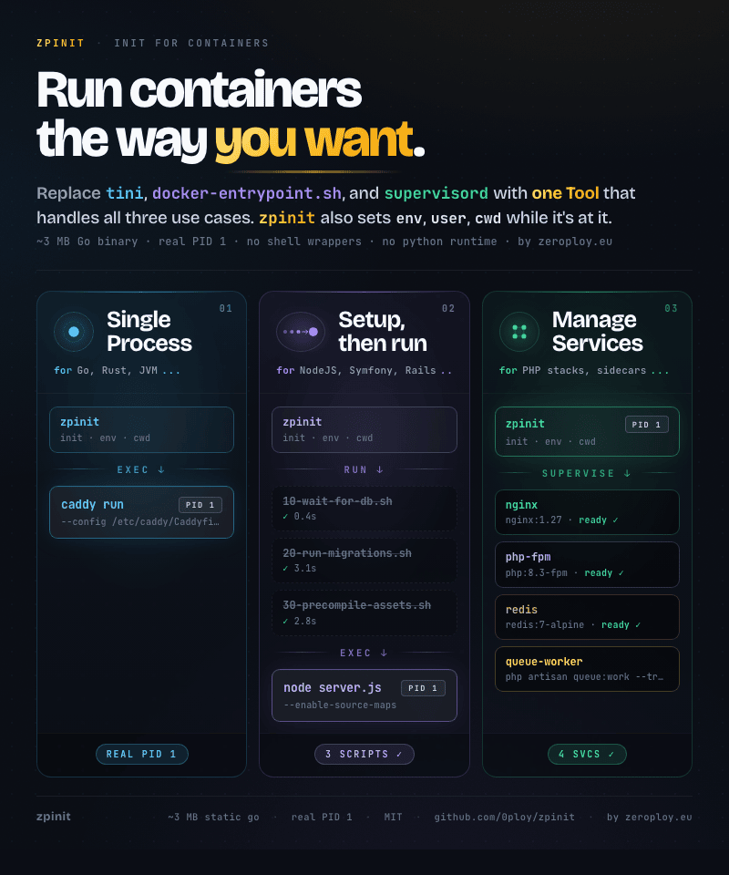

# zpinit

A single static Go binary that runs as PID 1 in your Docker container.
The same binary covers three distinct use cases, replacing the three
tools most images stitch together to do that job:

1. [**Single Process Mode**](#single-process-mode): replaces **tini**.
2. [**Setup, then Run Mode**](#setup-then-run-mode): replaces **`docker-entrypoint.sh`**.
3. [**Manage Services Mode**](#manage-services-mode): replaces **supervisord**.

One binary. One mental model. ~3 MB on disk, no Python, no shell wrappers.



## Single Process Mode

**When to use it.** Your image runs one well-behaved workload (a Go
server, a Node app, a long-running CLI) and you don't need any setup
work before it starts. Use this mode when you want every image in your
fleet to ship the same supervisor binary, even the trivial
single-process ones, so an image can grow into mode 2 or 3 later
without changing its `ENTRYPOINT`.

**What zpinit does.** Validates config, then `syscall.Exec`s your CMD.
The CMD takes over as PID 1; zpinit is gone after the exec. (If your
workload doesn't reap its own children and you need that, use [Manage
Services Mode](#manage-services-mode) with one entry instead. Then
zpinit stays as PID 1 and reaps for you.)

**Getting the binary.** Easiest path is multi-stage `COPY --from` out
of our published image: one Dockerfile line, no curl, no checksums,
layer cache plays nicely. Pin to a tag in production (`zpinit:v1.2.3`),
not `:latest`. `zpctl` is only needed for mode 3, so omit it here.

```dockerfile
FROM debian:stable-slim

RUN apt-get update && apt-get install -y my-app && rm -rf /var/lib/apt/lists/*

COPY --from=ghcr.io/0ploy/zpinit:latest /usr/local/bin/zpinit /usr/local/bin/

ENTRYPOINT ["zpinit"]
CMD ["my-app", "--port", "8080"]
```

**Fleet-wide env defaults.** A `[env]` block in `zpinit.toml` reaches
the wrapped CMD via the exec path, but NOT `docker exec` (which uses
the container's stored config). Container env (`docker run -e`)
overrides the toml. Full precedence chain in
[docs/configuration.md](docs/configuration.md).

```toml
# /etc/zpinit/zpinit.toml
[env]
APP_ENV   = "production"
LOG_LEVEL = "info"
```

## Setup, then Run Mode

**When to use it.** You need preparation work before the workload
starts: render config from env, apply migrations, fix permissions, warm
a cache. Today this lives in a `docker-entrypoint.sh` that ends with
`exec "$@"`. zpinit replaces that script with a directory of small
executables.

**What zpinit does.** Runs every executable in `/etc/zpinit/entrypoint.d/`
in lexicographic order, drains any zombies they leave behind, then
`syscall.Exec`s your CMD. A non-zero exit from a script aborts the
container (or continues, with `entrypoint_on_failure = "continue"`).

**Bonus: same image, three behaviors.** Because the CMD comes from
`docker run`, the same image is your daemon, your debug shell, and your
one-off task runner. The `entrypoint.d/` setup runs in all three:

```sh
docker run myimage                            # production: setup, then my-app
docker run -it myimage bash                   # debug: setup, then a shell
docker run --rm myimage php bin/console fix   # one-off task with the same setup
```

No separate "debug" image, no flags to flip modes. (Use
`zpinit --skip-entrypoint bash` if you want a shell without any
side-effecting setup.)

```dockerfile
FROM debian:stable-slim

RUN apt-get update && apt-get install -y my-app && rm -rf /var/lib/apt/lists/*

COPY --from=ghcr.io/0ploy/zpinit:latest /usr/local/bin/zpinit /usr/local/bin/
COPY entrypoint.d/ /etc/zpinit/entrypoint.d/

ENTRYPOINT ["zpinit"]
CMD ["my-app"]
```

**Fleet-wide env defaults.** A `[env]` block in `zpinit.toml` is visible
to every entrypoint.d script and to the wrapped CMD, but NOT to
`docker exec` (the env travels via the exec path, not the container's
stored config). Container env (`docker run -e`) overrides; scripts
writing to `/run/zpinit/env` override further. Full precedence chain in
[docs/configuration.md](docs/configuration.md).

```toml
# zpinit.toml
[env]
APP_ENV   = "production"
LOG_LEVEL = "info"
```

A setup script is just an executable. Any language with a shebang works:

```sh
#!/bin/sh
# entrypoint.d/10-migrate.sh
set -e
my-app db migrate
chown -R app:app /var/lib/my-app
```

Files have to be executable. Non-executable files are skipped at
runtime and surfaced as a warning by `--check-config`. Files starting
with `.` or ending in `.disabled` are ignored.

## Manage Services Mode

**When to use it.** Your image runs multiple processes that have to
come up in order: redis before the app, php-fpm before nginx, a worker
alongside php-fpm. Today this is supervisord plus tini in front.

**What zpinit does.** Reads `/etc/zpinit/services/*.toml`, starts each
service in filename order, and uses readiness probes to gate the next
service's start. zpinit stays around as PID 1: it reaps, restarts on
crash with backoff, applies config reloads, and handles graceful
shutdown.

The Dockerfile has **no `CMD`**. CMD wins over services, so adding one
puts you back in wrap mode and `services/` is ignored.

```dockerfile
FROM debian:stable-slim

RUN apt-get update && apt-get install -y nginx redis-server php-fpm \
 && rm -rf /var/lib/apt/lists/*

COPY --from=ghcr.io/0ploy/zpinit:latest /usr/local/bin/zpinit /usr/local/bin/
COPY --from=ghcr.io/0ploy/zpinit:latest /usr/local/bin/zpctl  /usr/local/bin/

COPY entrypoint.d/ /etc/zpinit/entrypoint.d/
COPY services/     /etc/zpinit/services/

ENTRYPOINT ["zpinit"]
# No CMD: supervise mode.
```

**Service files.** Filename order is boot order. Numeric prefixes
(`10_`, `30-`) are stripped from the resolved name (`10_redis.toml`
becomes `redis`). The optional `[ready]` block blocks the next
service's start until the probe exits 0.

```toml
# services/10_redis.toml
command = ["redis-server", "--daemonize", "no"]
restart = "always"

[ready]
command  = ["redis-cli", "ping"]
interval = "500ms"
timeout  = "30s"
```

```toml
# services/20_php-fpm.toml
command = ["php-fpm", "-F"]
restart = "always"

[ready]
command = ["sh", "-c", "test -S /run/php/php-fpm.sock"]
```

```toml
# services/30_nginx.toml
command = ["nginx", "-g", "daemon off;"]
restart = "always"
```

Boot order: redis starts, `redis-cli ping` is polled until it exits 0,
then php-fpm starts, the socket check passes, then nginx starts. Full
schema (env, cwd, user/group, log destinations, backoff, stop signals)
in [docs/configuration.md](docs/configuration.md).

**Foreground worker pattern.** Some services exist only to support the
*real* job. The Symfony case: php-fpm has to run, but the actual job is
a `messenger:consume` worker that should end the container when it
exits (so Kubernetes / Nomad / your scheduler can take over). Express
the worker as a service with `restart = "never"` plus `exit_code_from`:

```toml
# zpinit.toml
exit_code_from = "worker"
```

```toml
# services/99_worker.toml
name    = "worker"
command = ["php", "bin/console", "messenger:consume"]
restart = "never"
```

When `worker` exits, zpinit gracefully stops every other service (in
reverse filename order) and exits with the worker's exit code.

**Reload without restart.** `SIGHUP` (or `zpctl update`) re-reads
`/etc/zpinit/`, diffs against the running set, and applies:

- New file: start the new service.
- Removed file: graceful stop.
- Changed content: restart (unless `reloadable = false`).
- Renamed file: remove + add.

`zpctl reread` previews the diff without applying.

**Validate before deploying.**

```sh
zpinit --check-config /etc/zpinit/
```

Loads everything, applies defaults, validates, and either prints an OK
summary or every error in one pass. Exit 0 / 1.

**Operator commands.** `zpctl` talks to zpinit over `/run/zpinit.sock`.
State names match supervisorctl exactly so existing muscle memory
transfers.

```sh
zpctl status [service]           # all services, or one
zpctl start | stop | restart [svc]
zpctl signal redis HUP           # nginx-style "reload your own config"
zpctl pid [service]              # zpinit's PID, or the service's
zpctl tail redis                 # snapshot of file-logged stdout
zpctl update                     # apply config changes (= SIGHUP)
zpctl reread                     # dry-run config diff
zpctl shutdown
zpctl help
```

## Learn more

- [docs/why.md](docs/why.md): why we built this, design decisions, philosophy, non-goals.
- [docs/configuration.md](docs/configuration.md): full config schema (env, cwd, user/group, logs, backoff, stop signals, defaults).
- [docs/architecture.md](docs/architecture.md): packages, state machine, internals.
- [docs/development.md](docs/development.md): build, test, contribute.

## License

MIT. See `LICENSE`.
